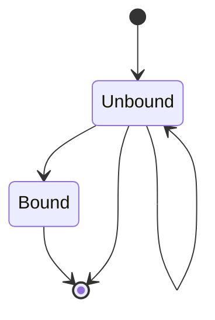

# Type-Driven API Design in Rust
From the recording of the presentation of the same name by Will Crichton at the Strange Loop Conference in St. Louis, USA.

I used different names for the type member in the last version of main.rs. I also preferred to call `last_element` or `num_elements` the `len` of the progress bar. 

Each of the files enumerated 1 to 5 has the code at different points of the talk. 

# Type State

In `5.main.type_state.rs` there are two states for an instance of Progress to be in: Unbound and Bound.

# References
1. https://youtu.be/bnnacleqg6k?si=1N58X2fte4oZB19M
